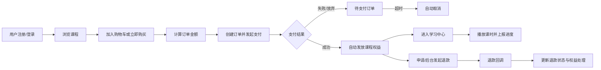
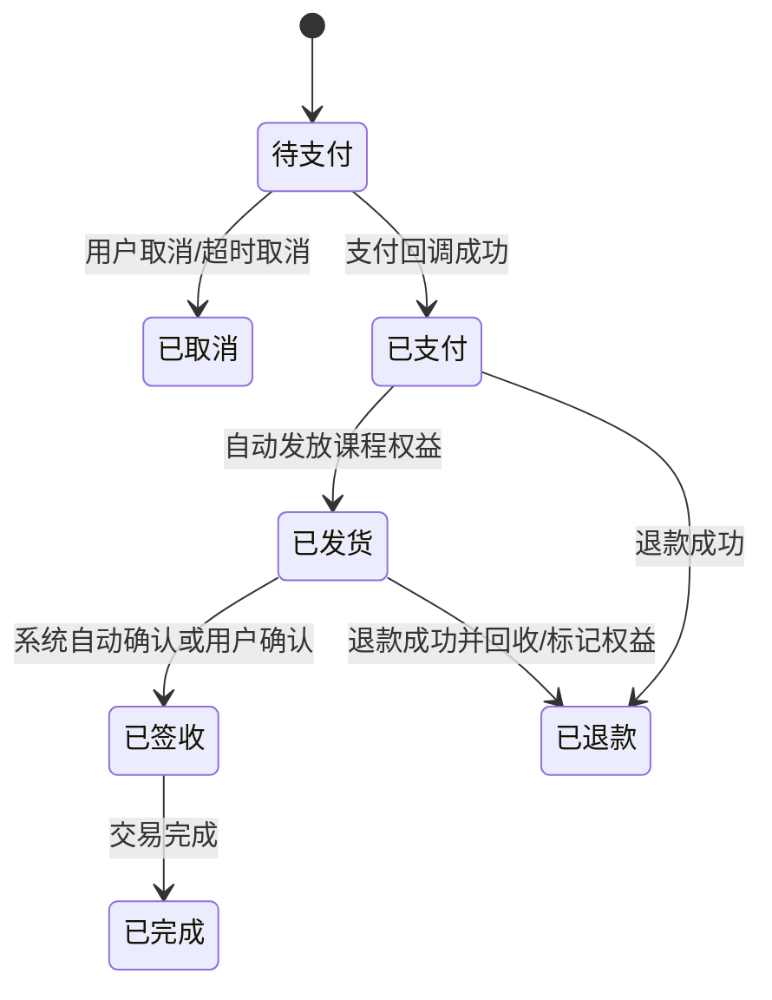
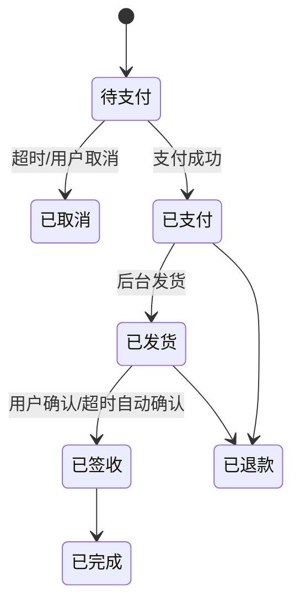

# 在线教育商城产品与业务文档

## 1. 文档目标

本文档用于沉淀在线教育商城 MVP 的产品范围、业务流程、角色权限、订单支付状态和运营后台能力，帮助产品、前端、后端和测试围绕同一套业务语言推进开发。

系统定位是一套课程类虚拟商品交易系统，先完成课程商品售卖、支付、自动发放课程权益、学习进度记录与后台运营管理闭环，后续保留扩展实物商品、物流发货、自动签收、智能推荐等能力。

## 2. 用户角色

| 角色 | 使用端 | 核心目标 | 关键能力 |
| --- | --- | --- | --- |
| C 端游客 | 前台用户端 | 浏览课程、登录注册 | 课程列表、课程详情、试看课时、手机号/微信登录 |
| C 端注册用户 | 前台用户端 | 购买课程并学习 | 购物车、下单支付、订单列表、已购课程、继续学习、播放进度 |
| 后台管理员 | 管理后台 | 运营课程、管理订单、配置系统 | 课程管理、课时管理、订单/退款、用户管理、统计 |
| 超级管理员 | 管理后台 | 系统初始化与权限治理 | 内置账号、管理员管理、角色配置、权限菜单配置 |
| 系统任务 | 服务端 | 保证订单状态自动流转 | 待支付超时取消、发货后自动签收、支付/退款回调补偿 |

## 3. MVP 范围

### 3.1 前台用户端

- 手机号验证码登录/注册。
- 手机号密码登录与重置密码。
- 微信扫码登录与微信绑定/解绑。
- 课程列表、课程详情、目录与课时展示。
- 试听课时、已购课时播放、学习进度上报与断点续播。
- 购物车添加、删除、列表。
- 下单前价格计算、立即支付、订单后续支付、取消订单。
- 我的订单、订单详情、已购课程、继续学习。

### 3.2 管理后台

- 管理员登录：手机号密码、手机号验证码、飞书扫码。
- 当前管理员信息、登出、飞书绑定/解绑。
- 管理员用户增删改查与角色分配。
- C 端用户查询与详情查看。
- 菜单权限树配置、角色配置、角色授权。
- 课时分类管理、录播课时管理、视频与附件上传。
- 课程商品管理、课程目录管理、课程课时编排。
- 订单列表、订单详情、后台取消、退款。
- 订单统计：按时间、商品、金额、退款等维度。

### 3.3 MVP 暂不实现但需预留

- 实物商品的地址、物流单、发货、确认收货。
- 优惠券、营销活动、会员价、分销。
- 支付宝支付。
- 搜索引擎、向量推荐、知识图谱推荐。
- 多商户、多店铺、多租户。
- 客服工单与复杂售后协商。

## 4. 核心业务闭环

## 5. 业务模块

### 5.1 账号与登录

C 端支持手机号验证码登录/注册、手机号密码登录、微信扫码登录、小程序登录、重置密码、微信绑定/解绑。

后台支持手机号密码登录、手机号验证码登录、飞书扫码登录、重置密码、飞书绑定/解绑。后台账号由内置超级管理员或有权限的管理员创建，不开放公开注册。

账号禁用要求：

- C 端用户被禁用后，后端需要踢出或失效该用户所有登录 token。
- 管理员被禁用后，管理后台所有 token 失效，动态菜单与接口权限同步拦截。
- 前端遇到 `401`、禁用态业务码或 token 失效时，清理本地状态并跳转登录。

### 5.2 RBAC 与动态菜单

权限表同时承载菜单权限和操作权限：

- `type=1`：菜单，影响左侧导航和路由可见性。
- `type=2`：操作，影响页面按钮、批量操作、接口调用前置判断。
- `page_path`：菜单路由路径。
- `parent_id`：构建树形菜单。
- `status=-1`：禁用后不出现在菜单和授权树中。

后台登录后加载当前管理员信息、角色与权限，前端按权限构建菜单树、路由访问守卫与按钮级权限。

### 5.3 商品与课程

当前商品类型以课程虚拟商品为主，对应 `course_goods`。商品详情由基本信息、封面、详情图、富文本详情、课程特色、服务时长、学习时长、更新状态与课程目录组成。

课程上架后 C 端可见，用户购买成功后生成 `user_course_goods` 权益，获得课程学习权限。课程目录和课时关系由后台维护，课时可设置试看和展示时间。

### 5.4 购物车

购物车用于承接「稍后购买」场景。MVP 中课程商品一般数量为 1，但表结构保留 `quantity`，为实物商品或套餐扩展留下空间。

关键规则：

- 同一用户同一课程不可重复加入购物车。
- 已购买课程不建议继续加入购物车，前端按钮展示为「去学习」。
- 下架课程在购物车中展示失效态，禁止结算。
- 结算时以服务端 `calc_fee` 返回结果为准，前端展示仅作参考。

### 5.5 订单与支付

订单分为订单主表与订单商品对象表。下单时必须保存商品快照，保证后续订单追溯不受商品改价、改名、下架影响。

订单状态：

| 状态值 | 名称 | 说明 | 前端主操作 |
| --- | --- | --- | --- |
| -1 | 已取消 | 用户、客服或超时取消 | 查看详情 |
| 1 | 待支付 | 订单已创建但未支付 | 继续支付、取消 |
| 2 | 已支付/待发货 | 对虚拟课程可理解为支付成功待发放或处理中 | 查看详情 |
| 3 | 已退款 | 全部或主状态退款完成 | 查看退款记录 |
| 4 | 已发货 | 实物发货或虚拟权益已交付 | 确认收货/查看权益 |
| 5 | 已签收 | 用户或系统确认签收 | 查看详情 |
| 6 | 已完成 | 交易完成 | 查看详情 |

课程虚拟商品的 MVP 建议状态流：

实物商品的后续状态流：

### 5.6 退款

退款由后台发起，支持选择订单明细、填写退款原因与金额。支付平台退款回调后更新退款记录与订单累计退款金额。

退款状态：

| 状态值 | 名称 | 说明 |
| --- | --- | --- |
| 0 | 无退款 | 默认态 |
| 1 | 退款中 | 已提交平台，等待结果 |
| 2 | 退款完成 | 平台回调成功 |
| 3 | 退款异常 | 平台失败、回调异常或人工介入 |

虚拟课程退款后的权益策略需要产品确认：

- 全额退款：建议冻结或删除对应课程权益，学习中心标记为「已退款不可学习」。
- 部分退款：建议保留权益，订单明细展示部分退款。
- 已学习后退款：需结合业务策略，可限制退款或转人工审核。

### 5.7 学习进度

学习进度由课时维度记录：

- 进入播放页时读取 `learn_info`。
- 播放中定时上报 `learn_report`。
- 暂停、切课、关闭页面前补充上报。
- 播放位置用于断点续播。
- 学习状态用于区分学习中与已学完。

继续学习列表展示用户最近学习课程和课时，提升复访效率。

## 6. 后台运营页面

| 模块 | 页面 | 核心能力 |
| --- | --- | --- |
| 工作台 | 数据概览 | 订单数、收入、退款、课程销售排行、待处理事项 |
| 用户管理 | C 端用户列表/详情 | 查询用户、查看手机号/微信绑定/已购课程/订单 |
| 管理员管理 | 管理员列表/创建编辑 | 分配角色、禁用、删除、飞书绑定状态 |
| 权限配置 | 菜单权限树 | 新增菜单/操作权限、批量保存、排序 |
| 角色管理 | 角色列表/授权 | 创建角色、启停角色、分配权限 |
| 课时管理 | 分类树、课时列表、课时表单 | 视频上传、附件、章节打点、启停 |
| 课程管理 | 课程列表、课程表单、目录编排 | 上下架、课程目录、课时排序、试看 |
| 订单管理 | 订单列表/详情 | 筛选、取消、退款、查看支付与退款记录 |
| 数据统计 | 订单统计 | 按日期、商品、金额、退款汇总 |

## 7. C 端页面

| 模块 | 页面 | 核心能力 |
| --- | --- | --- |
| 首页/课程 | 课程列表 | 搜索、筛选、课程卡片、继续学习入口 |
| 课程详情 | 详情页 | 课程介绍、目录、试看、购买状态、加入购物车/立即购买 |
| 登录注册 | 登录页 | 手机号验证码、手机号密码、微信扫码、滑块验证 |
| 购物车 | 购物车 | 勾选课程、移除、结算 |
| 确认订单 | 结算页 | 价格明细、备注、支付方式、提交支付 |
| 支付结果 | 支付二维码/结果页 | Native 码展示、轮询订单、支付成功跳转 |
| 我的课程 | 已购课程 | 有效期、去学习、过期提示 |
| 学习中心 | 播放页 | 视频播放、目录、附件、章节、进度上报 |
| 我的订单 | 订单列表/详情 | 待支付、取消、继续支付、退款记录 |
| 账号设置 | 个人资料 | 修改密码、绑定/解绑微信 |

## 8. 非功能需求

- 安全：token 鉴权、滑块验证码、短信/飞书验证码防刷、支付回调验签、接口幂等。
- 一致性：支付回调与主动查询结合，订单状态更新使用锁或幂等键。
- 可追溯：订单商品快照、退款记录、操作人、取消原因保留。
- 可扩展：商品类型、支付渠道、发货方式、权益类型以枚举和适配器扩展。
- 可运营：后台筛选、批量操作、状态标签、异常提示和操作日志预留。
- 可维护：前后端统一枚举、统一错误处理、统一时间和金额格式。

## 9. MVP 验收标准

- 管理员可登录后台并根据权限看到动态菜单。
- 超级管理员可创建管理员、角色、权限，并给角色分配菜单与操作权限。
- 后台可创建课程、上传封面/视频/附件、配置目录和试看课时。
- C 端用户可登录、浏览课程、加入购物车、下单并获取微信支付参数。
- 支付回调成功后用户获得课程权益，并能进入学习页播放与断点续播。
- 待支付订单超时可被取消，后台可查看订单详情并发起退款。
- 用户禁用后再次访问受保护接口时前端退出登录。

## 10. 后续演进

- 实物商品：增加 SKU、库存、收货地址、物流、发货单、自动签收。
- 多支付渠道：抽象微信/支付宝/余额支付适配层。
- 售后中心：用户申请退款、后台审核、凭证上传、协商记录。
- 内容运营：课程推荐位、分类、标签、专题页。
- 统计分析：用户转化漏斗、课程完课率、复购率、退款率。
- 服务拆分：用户、商品、订单、支付、内容、学习进度独立服务化。
