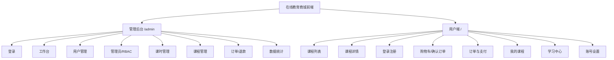
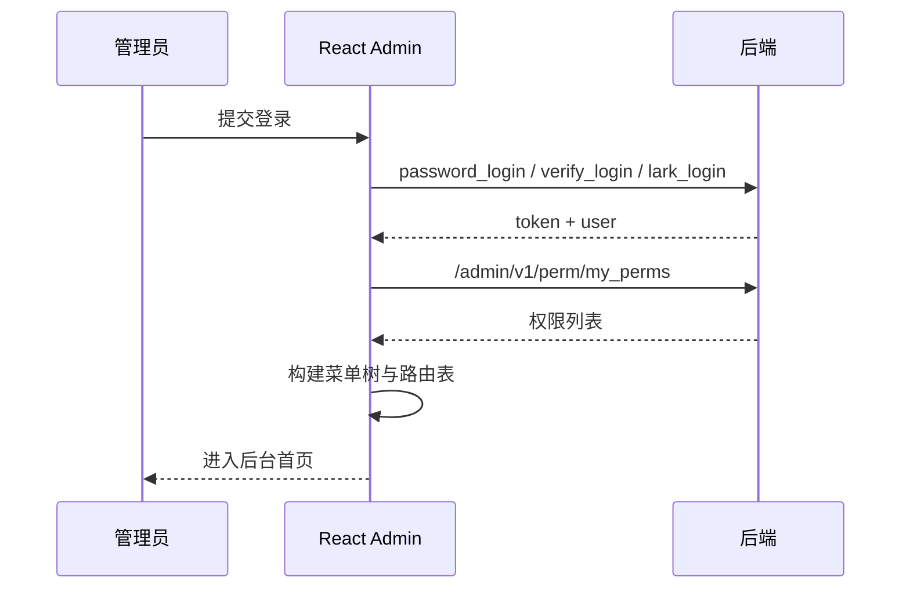
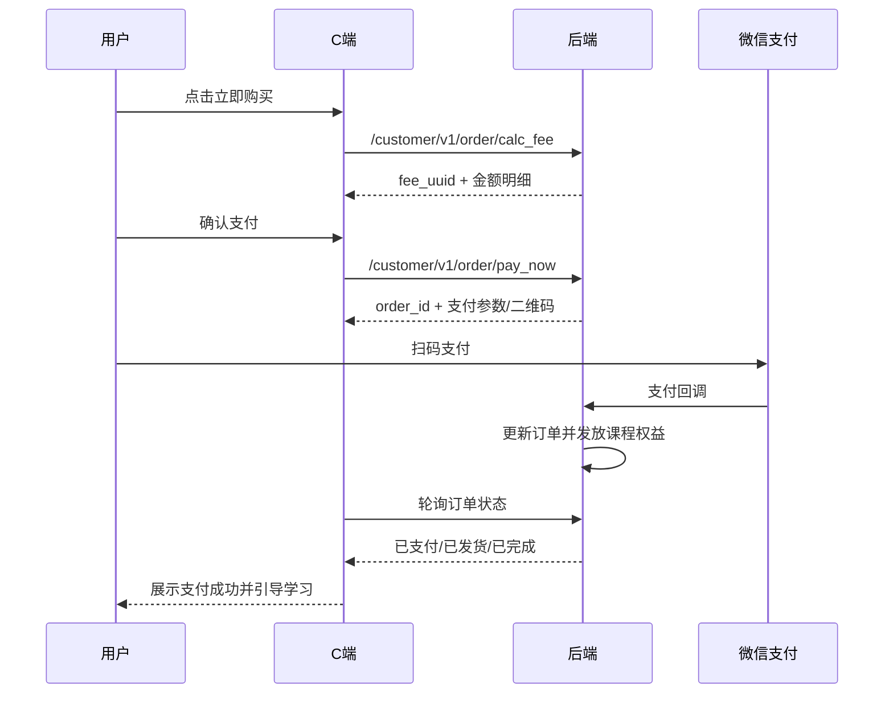
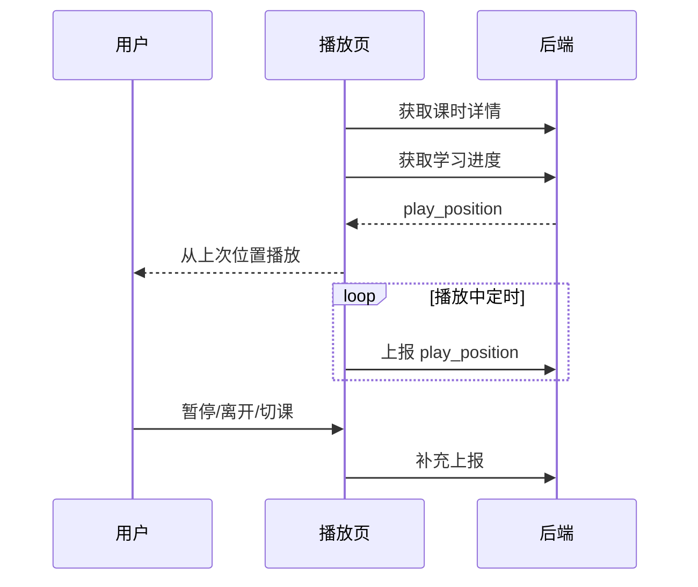

# 前端设计与交互成果

## 1. 设计原则

后台管理端面向运营与管理员，优先保证效率、清晰和可追溯。页面采用左侧菜单、顶部账号区、内容区表格/表单的管理台结构，重点页面使用筛选表单、数据表格、抽屉详情和确认弹窗。

C 端用户端面向课程购买和学习，优先保证从浏览、购买到学习的闭环顺滑。页面采用顶部导航、课程卡片、详情内容、支付确认和沉浸式学习播放器结构。

## 2. 视觉风格

### 2.1 后台管理端

- 基础框架：浅色工作台，左侧深色或浅灰侧边栏均可，建议默认浅色以降低疲劳。
- 主色：科技蓝，用于主按钮、选中菜单、链接。
- 辅助色：绿色表示成功/上架/已完成，橙色表示待处理，红色表示禁用/退款/取消。
- 字体层级：页面标题 20px，区块标题 16px，表格正文 14px，辅助说明 12px。
- 页面密度：偏紧凑，列表页默认一屏展示筛选、表格和分页。
- 组件风格：Ant Design，卡片圆角不超过 8px，表单项标签左对齐或顶部对齐按页面密度决定。

### 2.2 C 端用户端

- 基础框架：白底内容型课程平台，突出课程封面、价格、学习进度。
- 主色：蓝色或青蓝色，强调可信赖的在线教育感。
- 商品卡片：封面、课程名、特色标签、价格、更新状态、购买状态。
- 学习播放器：深色视频区 + 浅色目录/附件侧栏，降低观看干扰。
- 移动端：优先保证课程列表、详情、订单和播放页可用，后台端 MVP 可先以桌面优先。

## 3. 信息架构

## 4. 管理后台页面设计

### 4.1 登录页

页面目标：让管理员通过手机号密码、手机号验证码或飞书扫码进入后台。

布局：

- 左侧：产品名、项目定位和核心能力简短展示。
- 右侧：登录卡片，Tab 切换「密码登录」「验证码登录」「飞书扫码」。
- 密码登录：手机号、密码、滑块验证码、登录按钮、重置密码入口。
- 验证码登录：手机号、滑块验证、验证码、登录按钮。
- 飞书扫码：授权按钮或二维码状态区。

交互：

- 获取短信验证码前必须完成滑块验证。
- 登录失败展示表单内错误，不跳转。
- token 写入后请求当前管理员信息与权限，再进入后台首页。
- 无菜单权限时进入空权限页，提示联系超级管理员。

### 4.2 后台主框架

结构：

- 顶部：折叠菜单、面包屑、当前管理员、角色、飞书绑定状态、退出。
- 侧边栏：由 `/admin/v1/perm/my_perms` 返回的菜单权限动态生成。
- 内容区：路由页面。
- 按钮级权限：页面根据操作权限 code 控制显示和禁用。

菜单建议：

| 一级菜单 | 二级菜单 |
| --- | --- |
| 工作台 | 数据概览 |
| 用户管理 | C 端用户 |
| 系统配置 | 管理员管理、角色管理、权限菜单 |
| 内容管理 | 录播分类、录播课时、课程商品 |
| 交易管理 | 订单列表、退款处理、订单统计 |

### 4.3 工作台

核心组件：

- 今日订单数、今日实收、待支付订单、退款中订单。
- 近 30 天订单趋势图。
- 课程销售排行。
- 待处理列表：退款异常、待发货或待确认订单、禁用用户异常登录等。

MVP 可用订单统计接口支撑趋势图，其他卡片可由订单列表筛选聚合或后续新增接口。

### 4.4 C 端用户管理

列表筛选：

- 用户 ID、昵称关键词、手机号、状态。

表格列：

- 用户 ID、头像、昵称、手机号、微信绑定、状态、最近登录时间、创建时间、操作。

操作：

- 查看详情。
- 禁用/启用如果后端后续补接口，放在详情抽屉或行操作中。

详情抽屉：

- 基础信息：昵称、手机号、头像、性别、状态、微信绑定、小程序绑定。
- 已购课程：课程名、学习有效期、服务有效期。
- 订单摘要：订单 ID、状态、实付、创建时间。

### 4.5 管理员管理

列表筛选：

- 用户名关键词、手机号、角色、状态。

表格列：

- 管理员 ID、用户名、昵称、手机号、角色、飞书绑定、状态、创建时间、操作。

创建/编辑抽屉：

- 用户名、昵称、手机号、性别、角色、多选、状态。
- 内置超级管理员不可删除，关键字段不可随意禁用。

交互：

- 删除前二次确认。
- 禁用管理员后提示「该账号的登录态将失效」。
- 编辑角色后刷新当前行和权限缓存。

### 4.6 权限菜单

页面结构：

- 左侧或主区树形表格：菜单/操作权限。
- 顶部操作：新增一级菜单、批量保存排序、刷新。
- 行内操作：新增子级、编辑、删除、启用/禁用。

字段：

- 权限名称、权限编码、类型、页面路径、父级、排序、状态、描述。

交互：

- `type=1` 时要求填写页面路径。
- `type=2` 时页面路径可为空，用于按钮级权限。
- 删除菜单前提示会影响角色授权和动态菜单。
- 批量保存调用 `/admin/v1/perm/update`。

### 4.7 角色管理

页面结构：

- 列表：角色名称、描述、状态、权限摘要、创建时间、操作。
- 授权弹窗：左侧角色信息，右侧权限树复选。

交互：

- 勾选父级菜单时默认勾选必要子级，也允许细粒度取消操作权限。
- 保存调用 `/admin/v1/role/perm/sets`。
- 禁用角色后，该角色下管理员权限在下一次权限刷新后失效。

### 4.8 录播课时管理

页面结构：

- 左侧分类树：支持新增、编辑、删除、拖拽/排序。
- 右侧课时列表：筛选、创建课时、批量移动、启停。

课时表单：

- 基本信息：名称、分类、详情、状态。
- 视频：通过临时密钥上传，保存 `video_key`、`video_file_name`、`duration`。
- 附件：支持多个文件，保存 `origin_name`、`file_key`、`file_url`。
- 章节：章节名、开始时间、结束时间，可从播放器当前时间快速填入。

交互：

- 视频上传中禁止提交。
- 删除分类前提示是否包含子分类或课时。
- 课时禁用后，C 端目录展示不可播放或隐藏，具体由后端 `status` 控制。

### 4.9 课程商品管理

列表筛选：

- 课程 ID、课程名、创建时间、更新时间、更新状态、上下架状态、推荐。

表格列：

- 封面、课程名、价格、特色、学习时长、服务时长、更新状态、上下架、排序、更新时间、操作。

课程表单：

- 基本信息：名称、价格、服务时长、学习时长、排序、特色、更新状态。
- 图片：封面图、详情图。
- 详情：富文本或 Markdown。
- 状态：默认下架，编辑完成后手动上架。

课程目录编排：

- 左侧目录树，右侧可添加课时。
- 支持目录排序、课时排序、课时展示名、是否试看、展示时间。
- 页面顶部展示总课时数、总时长。

### 4.10 订单管理

列表筛选：

- 订单 ID、用户 ID、订单状态、商品名、创建时间、支付时间、退款时间。

表格列：

- 订单 ID、用户、商品摘要、订单状态、订单金额、实付金额、退款金额、支付单号、创建时间、操作。

详情抽屉/详情页：

- 订单主信息：状态、来源、金额、支付时间、取消信息、确认收货信息。
- 商品明细：商品快照、数量、实付、退款状态。
- 退款记录：金额、原因、平台退款单号、状态、完成时间。
- 操作区：取消订单、发起退款。

交互：

- 只有待支付订单允许后台取消。
- 只有已支付/已发货/已签收等支付成功后的订单允许发起退款。
- 退款金额不能超过可退金额。
- 退款提交后状态进入退款中，等待回调更新。

## 5. C 端页面设计

### 5.1 顶部导航

桌面端：

- 左侧 Logo/站点名。
- 中间：课程、我的课程、订单。
- 右侧：搜索框、购物车、头像/登录按钮。

移动端：

- 顶部保留站点名和用户入口。
- 底部导航：课程、学习、订单、我的。

### 5.2 课程列表

页面模块：

- 搜索与筛选：课程名、更新状态、推荐。
- 课程卡片：封面、标题、特色标签、价格、更新中/已完结、已购买标识。
- 操作按钮：查看详情、加入购物车、立即购买、去学习。

状态：

- 未登录：允许浏览课程，购买时引导登录。
- 已购买：主按钮为「去学习」。
- 下架：不展示或展示不可购买，由接口返回状态决定。

### 5.3 课程详情

布局：

- 首屏：详情封面、课程名、价格、特色、学习/服务有效期、购买 CTA。
- 详情：课程介绍。
- 目录：章节、课时、时长、试看标识、可见时间。
- 购买浮层：桌面右侧固定，移动端底部固定。

交互：

- 试看课时可直接播放。
- 非试看且未购买课时点击时弹登录或购买提示。
- 已购买用户点击课时进入学习页。
- 加入购物车成功后按钮短暂变为「已加入」，并更新购物车数量。

### 5.4 登录注册

页面方式：

- 弹窗登录：在购买、购物车、学习等动作触发。
- 独立登录页：支持直接访问。

Tab：

- 手机验证码登录/注册。
- 手机密码登录。
- 微信扫码登录。

交互：

- 获取验证码前完成滑块。
- 微信扫码后轮询 `/customer/v1/user/wechat/qrcode_status`。
- 登录成功后回到触发登录前页面，并继续原动作。

### 5.5 购物车

布局：

- 商品列表：勾选框、课程封面、标题、价格、状态、删除。
- 底部结算栏：已选数量、总价、优惠、应付、结算按钮。

交互：

- 勾选变化后调用 `calc_fee` 或本地预估后在结算页确认。
- 删除前轻量确认。
- 已失效商品禁止勾选。

### 5.6 确认订单与支付

确认订单页：

- 商品清单。
- 价格明细：原价、优惠、应付。
- 用户备注。
- 支付方式：微信支付，支付宝预留置灰。

支付页：

- Native 支付展示二维码。
- 显示订单号、支付金额、倒计时。
- 轮询订单详情或订单列表状态。
- 支付成功跳转「支付成功页」，按钮为「去学习」和「查看订单」。

异常：

- 计费结果过期：重新计算价格。
- 支付二维码过期：重新发起支付。
- 支付中断：保留待支付订单，用户可在订单列表继续支付。

### 5.7 我的课程

列表内容：

- 课程封面、名称、学习有效期、服务有效期、更新状态、最近学习课时、继续学习按钮。

交互：

- 优先展示继续学习列表。
- 已过期课程展示过期提示，播放入口禁用。
- 未学习课程按钮为「开始学习」。

### 5.8 学习中心

桌面布局：

- 左侧/主区：视频播放器。
- 右侧：课程目录。
- 下方：课时简介、附件、章节列表。

移动布局：

- 顶部视频播放器。
- 下方 Tabs：目录、附件、详情。

交互：

- 进入页面读取课时详情与学习进度。
- 自动跳转到上次 `play_position`。
- 播放中每 15 到 30 秒上报一次。
- 暂停、切换课时、页面隐藏、关闭前上报。
- 课时播放接近结束时标记已学完。
- 章节点击跳转指定时间。

## 6. 关键交互流程

### 6.1 登录后菜单生成

### 6.2 课程购买

### 6.3 学习进度

## 7. 状态与异常设计

| 场景 | 前端表现 | 推荐处理 |
| --- | --- | --- |
| token 失效 | Toast + 跳登录 | 清空 token 和用户缓存 |
| 权限不足 | 403 页面或按钮隐藏 | 动态菜单与操作权限双层控制 |
| 滑块过期 | 验证区刷新 | 重新获取验证码 |
| 短信频控 | 倒计时和错误提示 | 禁用发送按钮 |
| 计费过期 | 提示重新计算 | 重新调用 `calc_fee` |
| 支付未完成 | 保留待支付订单 | 可继续支付或取消 |
| 课程下架 | 商品不可购买 | 购物车内标记失效 |
| 权益过期 | 禁止播放 | 展示过期时间和续费预留 |
| 退款中 | 订单详情展示处理中 | 禁止重复提交退款 |

## 8. 组件清单

### 8.1 通用组件

- `AppLayout`：后台/前台布局。
- `AuthGuard`：登录守卫。
- `PermissionGuard`：操作权限守卫。
- `DataTable`：表格、分页、加载态。
- `FilterForm`：列表筛选。
- `StatusTag`：订单、课程、用户、退款状态。
- `MoneyText`：分转元展示。
- `TimeText`：毫秒时间戳格式化。
- `UploadField`：对象存储上传。
- `CaptchaSlider`：滑块验证码。
- `QrCodeLogin`：微信/飞书扫码登录。

### 8.2 后台业务组件

- `PermissionTreeTable`
- `RolePermissionModal`
- `AdminUserDrawer`
- `LessonCategoryTree`
- `LessonEditorDrawer`
- `CourseEditorDrawer`
- `CourseCatalogBuilder`
- `OrderDetailDrawer`
- `RefundModal`
- `OrderStatisticChart`

### 8.3 C 端业务组件

- `CourseCard`
- `CourseCatalog`
- `CartList`
- `CheckoutSummary`
- `PaymentQRCode`
- `OrderCard`
- `PurchasedCourseCard`
- `VideoPlayer`
- `LessonSidebar`
- `AttachmentList`
- `ChapterMarkers`

## 9. 文案规范

- 金额统一展示为 `¥99.00`。
- 时间统一展示为 `YYYY-MM-DD HH:mm`。
- 订单按钮文案：待支付用「继续支付」「取消订单」；已完成用「查看详情」；退款中用「退款处理中」。
- 禁用态提示避免技术语言，例如「账号已被禁用，请联系管理员」。
- 后台危险操作统一二次确认，并展示影响范围。

## 10. 响应式策略

- 后台管理端：桌面优先，最小支持 1280px 宽度；窄屏折叠菜单。
- C 端：移动端与桌面端均支持。
- 学习页：移动端播放器优先，占据首屏顶部；目录收纳到 Tabs。
- 表格在移动端尽量改为卡片列表，避免横向滚动影响主流程。
